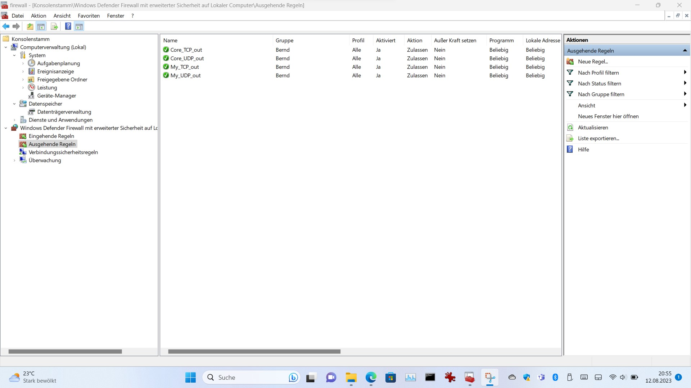

# Windows 11
Microsoft update and add powershell rules with every update

does it make windows a little more secure?

# automatic config windows Firewall with Powershell

## setup 
download, extract and run setup.cmd with admin

C:\AutoSecure

### setup.cmd
run as admin
this add runscript to scheduler
https://github.com/Bh67tablet/configWindowsFirewallPowershell/blob/6c058e6611c20f937ee1b3690349efec1e9e9bb0/setup.cmd#L1-L8

## run script
run powershell script and virus update and virus scan automatically
https://github.com/Bh67tablet/configWindowsFirewallPowershell/blob/6c058e6611c20f937ee1b3690349efec1e9e9bb0/startAutoSecure.cmd#L1-L8

## powershell script
delete all windows default firwall rules and add only core port rules https, mail, ...
https://github.com/Bh67tablet/configWindowsFirewallPowershell/blob/19e27612be8a5ea8fdb78dc8882a39e8b835d9dd/WindowsFirewallRolesSetup.ps1#L1-L108

